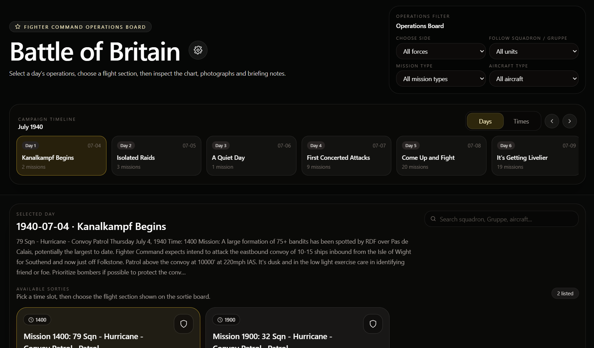
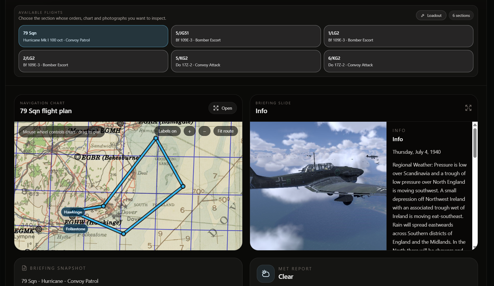
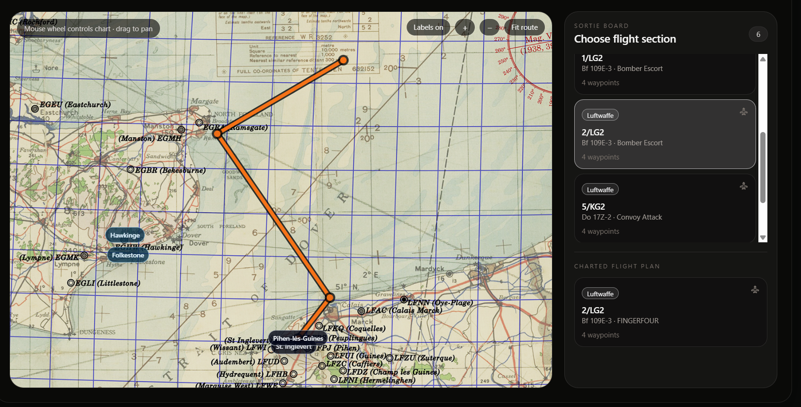
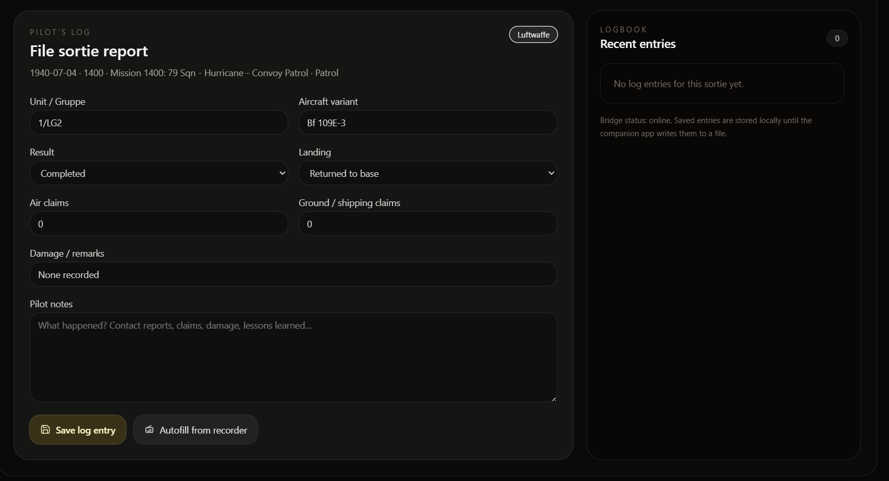
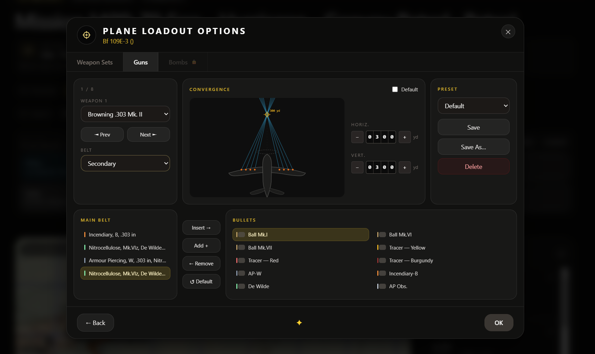

# Cliffs Campaign Board — Local Companion

This build is a local companion prototype for IL-2 Sturmovik: Cliffs of Dover / Tobruk campaigns.

## Main changes in this build

- Options panel is slimmer and only exposes settings that need user input.
- Default campaign folder points to the stock Battle of Britain campaign directory.
- Campaign title can be edited manually in Options.
- If the title field is blank, the scanner tries to read the campaign title from a parent `campaigns.ini`, then falls back to the folder name.
- Vanilla campaigns are scanned more intelligently:
  - dates/times are parsed from briefing text where possible, such as `0700 hours, 9th of April 1941`.
  - narrative briefing sections such as `Intro`, `Success`, and `Failure` are no longer treated as flyable sections.
  - if no explicit flyable section is found in briefing sections, the scanner falls back to the `.mis` player airgroup.
- Pilot log path uses generic `CampaignBoard` naming.
- Command file is `selected-mission.cmd`.
- Map selection is automatic by theatre; campaign images are referenced from their original folders.

Main Menu 1


Main Menu 2


Main Menu 3


Pilot Log


Plane Loadout - just conceptual

## First-time setup

```powershell
npm install
npm run build
copy companion-config.example.json companion-config.json
npm run companion
```

Open:

```text
http://127.0.0.1:8765/
```

## Folder picker note

The Browse buttons use a Windows PowerShell / WinForms folder dialog through the local companion bridge. This only works when the local companion server is running on the same Windows machine.

A hosted static website cannot browse local folders or launch local executables.

## Campaign title priority

When scanning a campaign folder, the display title is chosen in this order:

1. Options → Campaign display name
2. Matching title from parent `campaigns.ini`
3. Cleaned campaign folder name

## Maps and campaign assets

Map selection is automatic by theatre: Channel/Battle of Britain campaigns use `public/strait_of_dover_map.jpg`, and Tobruk campaigns use `public/tobruk_map.jpg`.

Campaign briefing images are not copied into the app. In local companion mode they are served from their original campaign folders through `/api/asset?path=...`.

For a future public/static web build, copied assets would still be required because a hosted website cannot read local campaign folders.


## v25 notes

Options now asks for a pilot log folder. The companion automatically creates `events.jsonl` inside that folder. Maps are always selected automatically from the theatre preset, and campaign images are always referenced from their original campaign folders through the companion bridge.
